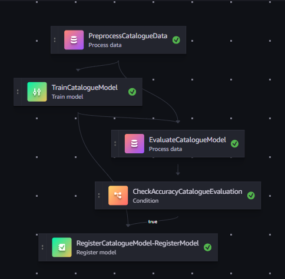

## Layout of the SageMaker ModelBuild Project Template

The template provides a starting point for bringing your SageMaker Pipeline development to production.

```
|-- codebuild-buildspec.yml
|-- CONTRIBUTING.md
|-- pipelines
|   |-- abalone
|   |   |-- evaluate.py
|   |   |-- __init__.py
|   |   |-- pipeline.py
|   |   `-- preprocess.py
|   |-- get_pipeline_definition.py
|   |-- __init__.py
|   |-- run_pipeline.py
|   |-- _utils.py
|   `-- __version__.py
|-- README.md
|-- sagemaker-pipelines-project.ipynb
|-- setup.cfg
|-- setup.py
|-- tests
|   `-- test_pipelines.py
`-- tox.ini
```

# 📘 Argos Discontinuation Prediction Pipeline

This project builds a SageMaker ML pipeline to predict whether products will be **discontinued** in upcoming Argos catalogue range refreshes.  
The solution supports **preprocessing, model training, evaluation, and artifact storage** in S3, as shown in figure 1.



---

## 🔄 Pipeline Stages

1. **Preprocessing**
   - Joins `ProductDetails` and `CatalogueDiscontinuation` datasets.
   - Cleans and encodes categorical variables (Supplier, Hierarchy levels, DI/DOM, etc.).
   - Filters to relevant horizons (`-12w, -8w, -4w`) for stable and realistic signals.
   - Outputs a parquet dataset for downstream training.

2. **Training**
   - Trains separate LightGBM models **per horizon** (`-12w, -8w, -4w`).
   - Uses early stopping and cross-validation metrics (`AUC`, `PR AUC`).
   - Stores trained model artifacts to S3 (`lgbm_model_horizon_Xw.txt`).

3. **Evaluation**
   - Computes accuracy, precision, recall, F1, ROC AUC, and PR AUC.
   - Generates and saves plots:
     - Confusion Matrix  
     - ROC Curve  
     - Precision-Recall Curve  
     - Feature Importance  
     - Threshold Tuning (Precision/Recall/F1 vs Threshold)  
   - Evaluation figures are saved automatically to S3.

---

## 📊 Business Value

- **-12w models:** Early warning, useful for supplier negotiations and long-lead planning.  
- **-8w models:** Best balance of early signal and reliability; supports operational planning.  
- **-4w models:** Highest accuracy and recall; best for clearance and final stock decisions.  

---

## 🚀 How to Run

1. Trigger the SageMaker pipeline from the console or CLI.  
2. Monitor step execution (Preprocess → Train → Evaluate).  
3. Retrieve:
   - **Trained models** in S3 (`output/models/`).  
   - **Evaluation plots & metrics** in S3 (`output/evaluation/`).  

---

## 📂 Outputs

- **Models:** `lgbm_model_horizon_-12w.txt`, `lgbm_model_horizon_-8w.txt`, `lgbm_model_horizon_-4w.txt`  
- **Evaluation Figures:** Confusion matrix, ROC, PR, feature importance, threshold tuning (per horizon)  

---

## ⚖️ Strategic Use

- **-12w → Strategic foresight**  
- **-8w → Operational sweet spot**  
- **-4w → Tactical execution**  

The pipeline enables **progressive decision-making**: flag risks early, refine mid-cycle, and confirm late.


TO D0: Add integration script to automatically trigger sagemaker pipeline when a change is made to the repo.